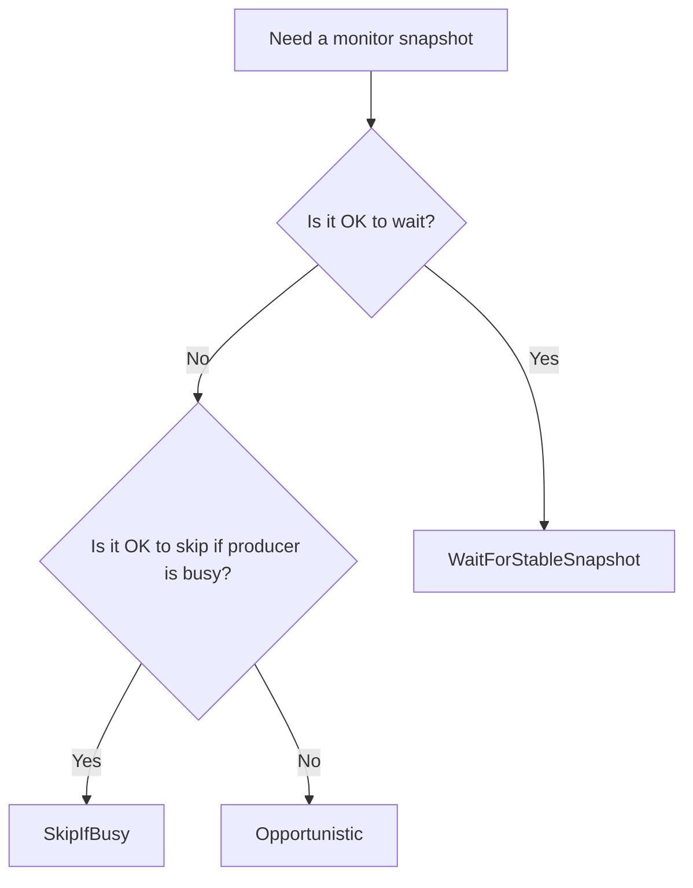

# Shared Memory Streaming

This directory contains Samosa's lock-free shared-memory snapshot streaming primitives:

* `Producer`: writes the next snapshot into shared memory
* `Consumer`: participates in the producer/consumer publication handshake and reads published snapshots
* `Monitor`: passively samples producer-written state for debugging, diagnostics, and observability

The main idea is simple:

* `Producer` and `Consumer` are the real dataflow
* `Monitor` is just watching from the side

If you keep that mental model in mind, the monitor API becomes much easier to reason about.

## Producer / Consumer Model

The normal streaming path is between exactly one producer and one consumer.

* The producer writes POD snapshots into one of two shared-memory slots.
* The consumer uses `read_index` and `write_index` as the ownership and publication handshake.
* Only the producer and consumer participate in that handshake.

`Monitor` is intentionally outside that protocol.

## What `Monitor` Is For

`Monitor` is a passive, best-effort observer.

* It does not write `read_index`.
* It does not write `write_index`.
* It does not reserve buffers.
* It does not add backpressure to the producer or consumer.
* It may skip samples.
* It returns only snapshots that pass monitor-side validation.

Best-effort here means:

* the monitor may skip snapshots
* a read may return nothing if the producer is busy or validation fails
* the monitor tries to return only validated whole-snapshot copies

In other words:

* lossy in time: yes
* intentionally lossy in snapshot integrity: no

That makes it useful for:

* debugging
* health checks
* lightweight observability
* "what is the producer writing right now?" style inspection

It is **not** a second consumer.

## What The Monitor Actually Samples

The monitor does **not** read "the snapshot currently published to the consumer."

Instead, it samples producer-written monitor metadata:

* `last_written_buffer`
* monitor sequence metadata
* per-slot monitor write metadata

So the monitor answers:

> "What is the latest producer-written snapshot that the monitor can validate right now?"

not:

> "What snapshot is the consumer currently allowed to read?"

Those are often close, but they are intentionally different contracts.

## Snapshot Validation

All monitor modes use post-copy validation.

At a high level, the monitor:

1. chooses the most recent producer-written slot it can inspect
2. copies that slot into local memory
3. checks monitor metadata again after the copy
4. rejects the sample if the metadata suggests the producer overlapped the copy

This is why the monitor may skip samples:

* if the producer is busy
* if the timeout expires
* if validation says the copied snapshot is suspicious

The goal is to skip questionable samples rather than knowingly return partial or mixed data.

## Basic Usage

```cpp
#include "dex/infrastructure/shared_memory/shared_memory_monitor.h"

using dex::shared_memory::Monitor;
using dex::shared_memory::MonitorReadMode;

Monitor<Telemetry> monitor{"/telemetry_stream"};

auto latest = monitor.GetLatestBuffer(0.05, MonitorReadMode::WaitForStableSnapshot);
if (latest) {
  Inspect(latest->get());
}
```

You can also run a loop:

```cpp
monitor.Run(
    [](const Telemetry& snapshot, uint64_t sequence) {
      Inspect(snapshot, sequence);
    },
    0.1,
    0,
    MonitorReadMode::WaitForStableSnapshot);
```

## The Three Modes In Plain English

The modes only answer one question:

> "What should the monitor do if the producer might be writing right now?"

There are only three policies:

1. `SkipIfBusy`: do not even try right now
2. `WaitForStableSnapshot`: wait for a stable moment, then try
3. `Opportunistic`: try immediately anyway

## Quick Decision Guide



If you are unsure, start with `WaitForStableSnapshot`.

## Mode Semantics

### `SkipIfBusy`

Think:

> "If the producer looks busy, come back later."

Use this when:

* you want the monitor to stay conservative
* dropping samples is fine
* you do not want to spend time waiting

Behavior:

* if the producer is already writing when the read begins, the monitor returns `nullopt`
* if validation detects overlap after the copy, the monitor discards the sample
* it will not knowingly accept a suspicious in-flight copy

Recommended for:

* dashboards
* periodic health sampling
* low-priority observability loops

### `WaitForStableSnapshot`

Think:

> "Give me the strongest monitor snapshot you can get within this timeout."

Use this when:

* you want the strongest validated monitor snapshot
* you can tolerate waiting up to `timeout_sec`
* you care that the returned sequence matches the accepted sample

Behavior:

* if the producer is already writing, the monitor waits for monitor metadata to change
* waiting is bounded by `timeout_sec`
* only validated snapshots are returned
* if the timeout expires or validation never succeeds, the read returns `nullopt`

Recommended for:

* debugging tools
* manual inspection utilities
* correctness-oriented diagnostics

### `Opportunistic`

Think:

> "Try now. If the copy looks suspicious, throw it away."

Use this when:

* you want the most aggressive best-effort sampling
* you prefer trying immediately over waiting
* skipping some samples is acceptable

Behavior:

* the monitor may attempt a copy even while a producer write is in flight
* it still performs post-copy validation
* detected overlap is discarded rather than knowingly returned
* this mode is still lossy and best-effort

Recommended for:

* high-rate telemetry taps
* lightweight debug views
* "show me something current if you can" tools

## What The Monitor Guarantees

The monitor guarantees:

* passive observation only
* no writes to producer/consumer ownership state
* no locks in the monitor path
* bounded waiting in `WaitForStableSnapshot`
* validated snapshots only
* sequence numbers returned to callbacks match the accepted snapshot
* lossy sampling in time, not intentional lossiness in snapshot integrity

## What The Monitor Does Not Guarantee

The monitor intentionally does **not** guarantee:

* delivery of every produced snapshot
* alignment with consumer-visible publication state
* zero waiting
* zero drops
* zero retries
* perfect detection of every theoretical race on every architecture

It is a diagnostics primitive, not part of the production ownership flow.

## Why The Design Stays Passive

The monitor uses copy-and-validate logic instead of joining the producer/consumer handshake.

That means:

* no buffer reservation
* no ownership transfer
* no changes to consumer semantics
* no producer blocking
* no producer backpressure from the monitor

This is the core tradeoff:

* monitor snapshots are best-effort and may be skipped
* production dataflow stays fast and isolated

## Notes

* The shared-memory buffer type must be POD.
* The streaming path assumes exactly one producer.
* For production dataflow, use `Consumer`.
* For passive inspection, use `Monitor`.
