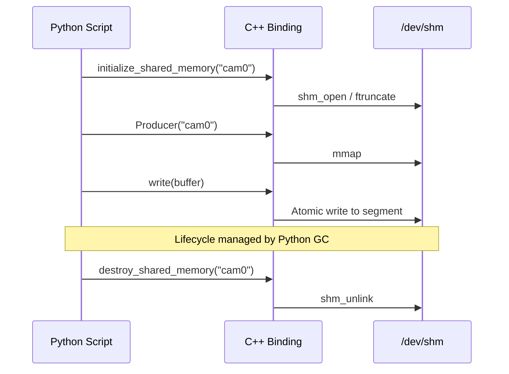
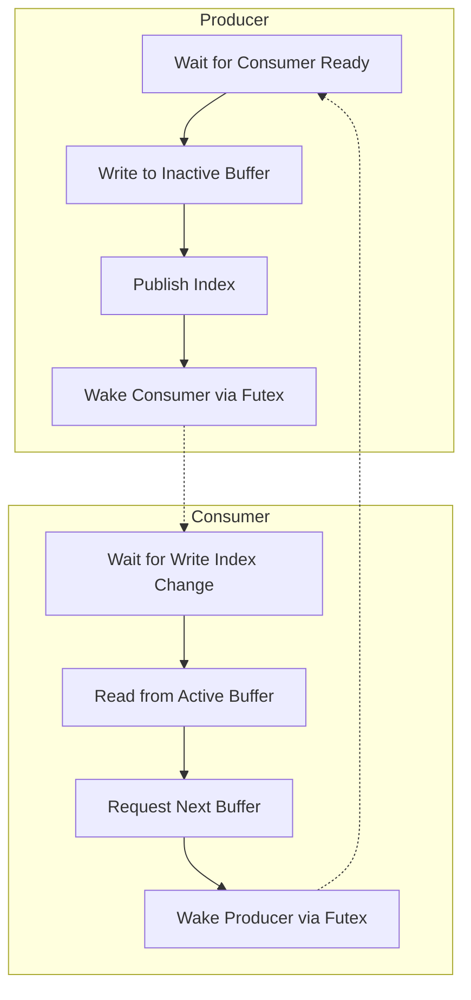

# Shared Memory Camera Python Bindings

This library provides high-performance Python bindings for the C++ lock-free shared memory streaming infrastructure, specifically tuned for `CameraFrameBuffer` data.

## Overview

The bindings bridge the gap between the low-latency C++ `dex::shared_memory` system and the Python ecosystem (NumPy, OpenCV, Rerun). They enable Python applications to act as either producers or consumers of high-bandwidth video data with minimal overhead.

## Implementation Details

### Technology Stack
- **[nanobind](https://github.com/wjakob/nanobind)**: Used for generating lean, fast Python bindings with lower overhead than pybind11.
- **NumPy Integration**: Uses `nb::ndarray` to provide zero-copy views into raw C++ memory buffers.

### High-Performance Memory Management
- **Zero-Copy Image Access**: The `color_image_bytes`, `depth_image_bytes`, and `color_stereo_right_image_bytes` fields are exposed as NumPy-compatible array views. Accessing these in Python does not copy the raw image data; it merely points to the existing C++ memory segment.
- **Heap-Allocated PODs**: Since `CameraFrameBuffer` is roughly 20MB, it exceeds the default Linux stack size (8MB). The bindings ensure that all buffer instances returned to Python are heap-allocated (`std::make_unique`) and managed by Python's Garbage Collector via `nb::rv_policy::take_ownership`.
- **GIL Management**: All blocking shared memory operations (e.g., waiting for a new frame in `Consumer.read()`) explicitly release the Python Global Interpreter Lock (GIL). This allows other Python threads to continue execution while the C++ thread is parked on a futex.

## Type Mappings

| C++ Type | Python Type | Description |
| :--- | :--- | :--- |
| `uint32_t` / `uint64_t` | `int` | Standard scalar conversion. |
| `std::array<std::byte, N>` | `numpy.ndarray` | Zero-copy view of the raw buffer. |
| `std::array<char, 64>` | `str` | Automatic conversion between null-terminated C-strings and Python strings. |
| `Producer<Buffer>` | `shm.Producer` | Binding for the C++ Producer template. |
| `Consumer<Buffer>` | `shm.Consumer` | Binding for the C++ Consumer template. |

## Lifecycle and Ownership

The C++ shared memory segments are persistent in `/dev/shm`.



## Flow and Timing

The underlying protocol uses a double-buffered lock-free state machine.



## Usage Example

### Consumer (Subscriber)
```python
import dex.vision.shared_memory as shm
import numpy as np

# Connect to existing segment
consumer = shm.Consumer("camera_stream")

while True:
    # read() blocks until a new frame is available (releasing the GIL)
    frame = consumer.read()
    if frame:
        # Zero-copy access to image data
        image = np.array(frame.color_image_bytes[:frame.color_image_size]).reshape((frame.color_height, frame.color_width, 3))
        print(f"Received frame {frame.frame_id}")
```

### Producer (Publisher)
```python
import dex.vision.shared_memory as shm
import time

shm.initialize_shared_memory("camera_stream")
producer = shm.Producer("camera_stream")

frame = shm.CameraFrameBuffer()
frame.frame_id = 0
# ... populate other fields ...

while True:
    producer.write(frame)
    frame.frame_id += 1
    time.sleep(1/60)
```

## Benchmarking

A high-performance benchmark is included to measure throughput, latency, and memory usage. It uses `multiprocessing` to simulate independent production and consumption.

To run the benchmark:
```bash
bazel run //dex/vision/bindings/python:shared_memory_benchmark -- --frames 2000 --frequency 120 --warmup 200
```

To run the unit tests:
```bash
bazel test //dex/vision/bindings/python:shared_memory_bindings_test
```

### Expected Warnings and Errors
When running the benchmark, you may encounter the following logs which are expected behavior:

1. **`FutexWait timed out` (Warning)**: This occurs at the end of the benchmark when the producer finishes and the consumer times out waiting for a new frame. It confirms the C++ timeout mechanism is working.
2. **`shm_unlink error: Inappropriate ioctl for device` (Error)**: This is an artifact of Docker on macOS virtualization of the `/dev/shm` filesystem. The unlink operation usually succeeds despite this message.
3. **Total Samples < (Frames - Warmup)**: Samosa uses **snapshot semantics**. If the consumer is slower than the producer (common in containerized environments), it will drop older frames to provide the most recent data. This is by design to prevent latency build-up.

### Benchmark Metrics
The benchmark reports:
- **Throughput (FPS)**: Effective frames per second processed.
- **Latency (Min, Avg, Median, Max, P95)**: Precise timing from producer timestamp to consumer receipt.
- **Memory Stability Analysis**:
    - **Initial/Final/Peak RSS**: Tracking the memory footprint of both processes.
    - **Memory Climb**: The delta between start and end, used to identify potential leaks.
    - **Status**: Automatic classification of memory behavior (STABLE vs. CLIMBING).
